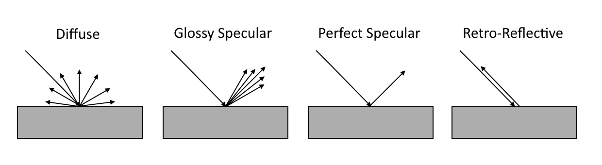
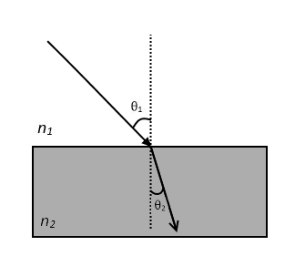
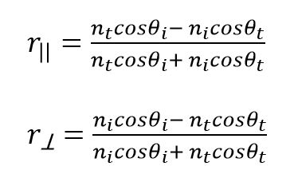
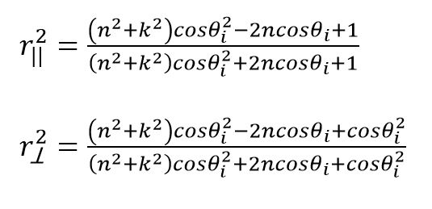
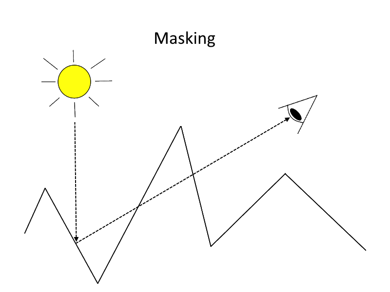
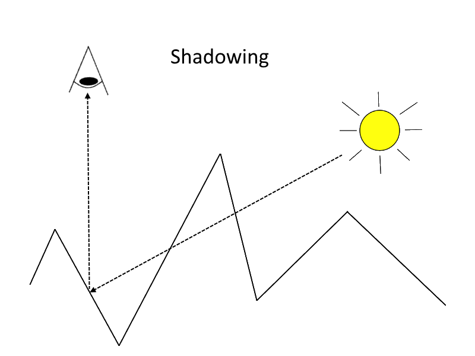
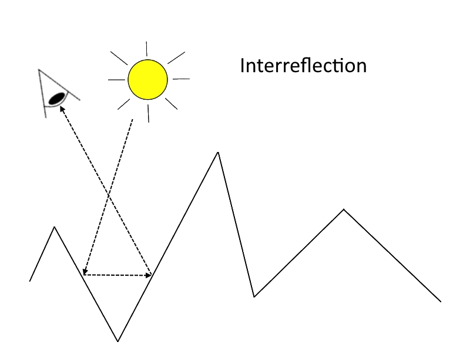

# Physically-Based Rendering: From Theory to glTF   基于物理的渲染：从理论到glTF
Mohamad Moneimne, University of Pennsylvania

## What is PBR?
Physically-Based Rendering (PBR) refers to techniques that attempt to simulate light in order to render photorealistic images. As indicated by the name, these techniques focus on our understanding of physics to model how light interacts with surfaces that have different physical properties. Since these interactions happen on a very fine level, PBR techniques often use statistical models to add realism and complexity to renders. 基于物理的渲染（PBR）是指尝试模拟光以渲染逼真图像的技术。正如名称所示，这些技术专注于我们对物理学的理解，以模拟光与具有不同物理特性的表面的相互作用。由于这些交互发生在非常精细的层面上，PBR技术通常使用统计模型来为渲染添加真实性和复杂性

PBR has been around for several years now, but was initially too computationally expensive to be a viable option for real-time applications. However, with the continuous advancement of computing power, it has increasingly become an industry standard in real-time graphics. In fact, much of the real-time software we see today such as Unreal Engine 4, Unity 5, Frostbite, and many others use physically-based rendering techniques to provide their users with the ability to create highly realistic 3D scenes. PBR已经存在了好几年了，但最初计算成本太高，无法成为实时应用的可行选择。然而，随着计算能力的不断提高，它已越来越成为实时图形的行业标准。事实上，我们今天看到的许多实时软件，如虚幻引擎4，Unity 5，Frostbite和许多其他软件，都使用基于物理的渲染技术，为用户提供创建高度逼真的3D场景的能力

The goal of this article is to provide some intuition behind PBR theory and cover a bit of the mathematical foundation before discussing the relationship between PBR and glTF. 本文的目的是提供PBR理论背后的一些直觉，并在讨论PBR和glTF之间的关系之前介绍一些数学基础

</img>
From Marmoset Toolbag Tutorials: [Physically-Based Rendering, And You Can Too!](https://www.marmoset.co/posts/physically-based-rendering-and-you-can-too/), by Joe "Earthquake" Wilson

## How do we model light-object interactions in PBR?   我们如何模拟PBR中的光对象交互？
The physics law most central to PBR is the law of conservation of energy. This law states that the total amount of energy within an isolated system remains constant, but how does this relate to rendering? In PBR, radiance is the energy that is conserved, meaning the amount of incoming light at any point in the scene is equal to the sum of the reflected, transmitted, and absorbed light at that point. PBR最重要的物理定律是能量守恒定律。该定律指出孤立系统内的总能量保持不变，但这与渲染有何关系？在PBR中，辐射是守恒的能量，意味着场景中任何点的入射光量等于该点处的反射光，透射光和吸收光的总和

Within any environment, it is easy to see several examples of complicated surfaces that seem to interact with light differently. For example, mirrors reflect perfect images, plastics are shiny, and chalkboards are matte. All of these unique properties can be modeled by considering general mathematical functions called **Bidirectional Scattering Distribution Functions** (**BSDFs**). These functions describe how light scatters upon contact with a surface based on the properties that surface holds. More specifically, they follow a statistical model to tell the user how likely the incident light is scattered in a specific outgoing direction. 在任何环境中，很容易看到几个复杂曲面的例子，它们似乎与光的交互方式不同。例如，镜子反射完美的图像，塑料有光泽，黑板是无光泽的。所有这些独特属性都可以通过考虑称为双向散射分布函数（BSDF）的一般数学函数来建模。这些函数描述了光在与表面接触时如何根据表面所具有的属性进行散射。更具体地说，它们遵循统计模型来告诉用户入射光在特定输出方向上散射的可能性

BSDF sounds like a very complicated term for what it actually means, so let’s break it up and explain its parts...  <brBSDF对于它实际意味着什么听起来是一个非常复杂的术语，所以让我们分解并解释它的各个部分 
* **Bidirectional** refers to the notion that at any point on a surface, light comes in and light goes out. 双向是指在表面上的任何点处，光进入并且光熄灭的概念 
* **Scatter** describes that light coming from one direction onto a surface can end up splitting into a range of directions. For example, light can either scatter by being reflected from or transmitted through the surface in certain directions. 散射描述了从一个方向到达表面的光最终会分裂成一系列方向。例如，光可以通过在某些方向上从表面反射或表面透过而散射 
* Finally, the details for how light scatters can be described using **distribution functions**, which entail how light is likely to be distributed in certain directions based on the physical properties of the surface. This can be anything from an equal scatter in all directions to a perfect reflection in a single direction. 最后，可以使用分布函数来描述光散射的细节，分布函数需要基于表面的物理特性计算在某些方向上光的散射。这可以是从所有方向上的相等散射到单个方向上的完美反射的任何事物

To help better understand the kinds of BSDFs that occur, we can consider two general types... 为了更好地理解发生的BSDF种类，我们可以考虑两种一般类型 
* **BRDFs** (Bidirectional Reflectance Distribution Functions) specifically correspond to BSDFs that describe how light is _reflected_ from a surface. This reflected light refers to the colors we see coming directly from a surface. At this point, it is normal to ask something along the lines of the following: If I shine a white light at a banana, why does it appear yellow instead of white? This is because not all light is just reflected from a surface. While surfaces reflect light of certain colors (wavelengths), they absorb or transmit the remaining energy. For bananas, wavelengths in the yellow spectrum are mainly reflected while other wavelengths are absorbed. （双向反射分布函数）特别对应于描述光如何从表面反射的BSDF。这种反射光指的是我们看到的直接来自表面的颜色。在这一点上，通常会问以下问题：如果我在香蕉上发出白光，为什么它会显示为黄色而不是白色？这是因为并非所有的光都只是从表面反射出来。虽然表面反射某些颜色（波长）的光，但它们吸收或传输剩余的能量。对于香蕉，黄色光谱中的波长主要被反射，而其他波长被吸收  
* **BTDFs** (Bidirectional Transmittance Distribution Functions) specifically correspond to BSDFs that describe how light is _transmitted_ through a surface. This can be seen in examples such as glass and plastics where we can see light that has traveled through the surface. （双向透射率分布函数）具体对应于描述光如何穿过表面传输的BSDF。这可以在诸如玻璃和塑料的例子中看到，其中我们可以看到已经穿过表面的光。

There exist other types of density functions that account for effects such as subsurface scattering (the effect in which light enters a material and bounces around before exiting again in some other position and direction). 还存在其他类型的密度函数，来计算光照效果诸如次表面散射（光进入材料并在其他位置和方向再次退出之前反弹）

## What are the reflection models?  什么是反射模型？
There are four general surface types with reflection distribution functions (BRDFs) that describe the probability that light scatters in all directions: 有四种具有反射分布函数（BRDF）的一般表面类型，用于描述光在所有方向上散射的概率：  
* **Diffuse** – surfaces that scatter light equally in all directions, e.g., even color of a chalkboard  漫反射 - 在所有方向上均匀散射光的表面，例如，黑板的颜色  
* **Glossy specular** – surfaces that scatter light preferentially in a set of reflected directions and show blurry reflections, e.g., specular highlights on plastic  有光泽的镜面 - 优先在一组反射方向上散射光线并显示模糊反射的表面，例如塑料上的镜面高光  
* **Perfect specular** – surfaces that scatter light in a single outgoing direction such that the angle of incident light is equal to the outgoing light with respect to the surface normal, e.g., perfect reflection of mirrors   完美的镜面反射 - 在单个出射方向上散射光的表面，使得入射光的角度等于相对于表面法线的出射光，例如镜子的完美反射  
* **Retro-reflective** – surfaces that scatter light primarily back along the incident direction of the light source, e.g., specular highlights on velvet 逆反射 - 这些表面主要沿光源的入射方向散射光，例如天鹅绒上的镜面高光

</img>

However, it is highly unlikely that a surface in reality will follow only one of these models. Because of this, most materials can be modeled as a complex mix of these. 然而，现实中的表面极不可能仅遵循这些模型中的一个。因此，大多数材料可以模拟为这些材料的复杂混合物

For each of these types of reflection, the distributions can be isotropic or anisotropic. 对于这些类型的反射中的每一种，分布可以是各向同性的或各向异性的 
* **Isotropic** – The amount of light reflected doesn’t change at a point when rotating the object about its normal. This is true for most surfaces we see in daily life. 各向同性 - 当物体围绕其法线旋转时，反射的光量不会发生变化。对于我们在日常生活中看到的大多数表面都是如此  
* **Anisotropic** – The amount of light varies at a point as the object is rotated about its normal. This occurs because the small bumps and grooves on the surface are mostly oriented in the same direction instead of randomly, which results in elongated and blurry reflections. This can be seen in certain materials such as in brushed metal and velvet. 各向异性 - 当物体围绕其法线旋转时，光线的数量会发生变化。发生这种情况是因为表面上的小凸起和凹槽大多朝向相同方向而不是随机方向，这导致细长且模糊的反射。这可以在某些材料中看到，例如拉丝金属和天鹅绒

## What about BTDFs?
The types of reflection distributions also apply to transmission (excluding retro-reflection), but conversely discuss how light travels after passing through a surface. The direction light travels after passing through the material is often dependent on the properties of the material itself. 反射分布的类型也适用于透射（不包括后向反射），但相反地讨论光在穿过表面后如何行进。光穿过材料后行进的方向通常取决于材料本身的特性

To discuss how this differs from reflection, consider a single light ray that has passed through a surface, as in the case of perfect specular transmission. For perfect specular transmission, the angle at which the light continues to propagate depends on the **index of refraction** of the medium. This follows **Snell’s Law**, which is described using the equation **_n1θ1 = n2θ2_**. 要讨论它与反射的不同之处，请考虑通过表面的单个光线，如完美镜面透射的情况。对于完美的镜面透射，光继续传播的角度取决于介质的折射率。这遵循斯涅尔定律，其使用等式n1θ1=n2θ2来描述

</img>

where _n_ is the index of refraction of the first and second media and _θ_ is the angle of the light with respect to the normal as it hits then passes through the surface. This means that if the indices of refraction of both media are the same, then light continues perfectly straight. However, if the indices are different, light will bend in a different direction once passing on to the next medium. A good example of this is how light moving from the air into water gets bent, causing distortions in what we see in the water. 其中n是第一和第二介质的折射率，θ是光击中然后穿过表面时相对于法线的角度。这意味着如果两种介质的折射率相同，那么光继续完全笔直。但是，如果指数不同，一旦传递到下一个介质，光将以不同的方向弯曲。这方面的一个很好的例子是从空气中流入水中的光是如何弯曲的，导致我们在水中看到的扭曲

This is unlike perfect specular _reflection_ where the incident angle will always be equal to the outgoing angle. 这与完美的镜面反射不同，其中入射角总是等于出射角

## How much light is reflected and transmitted? 反射和透射多少光？
It is important for physically-based renderers to know how much light is reflected or transmitted on a surface. It is a combination of these effects that describe substances such as honey and stained glass that both have color and can be seen through.  对于基于物理的渲染器而言，重要的是要知道在表面上反射或透射了多少光。这些效果的组合可以描述蜂蜜和彩色玻璃等物质，它们都具有颜色并且可以透视

These amounts are directly related to each other and described by the **Fresnel equations**. The equations are described for two types of media, _dielectrics_ and _conductors_.  这些量彼此直接相关并由菲涅耳方程描述。该方程描述了两种类型的介质，电介质和导体 
* **Dielectrics**: These are media such as glass, plastic, and ceramics, that transmit electricity without conducting (i.e. insulators). We can approximate the amount of energy that is reflected and transmitted by these surfaces using the following equations...

    </img>

    where _r||_ is the Fresnel reflectance for parallel polarized light and _r⟂_ is the reflectance for perpendicular polarized light. The subscripts correspond to incident (_i_) and transmitted (_t_) directions.
For unpolarized light, Fresnel reflectance can be modeled as **_Fr = 0.5(r||2 + r⟂2)_**. Then, due to conservation of energy, Fresnel transmittance can be modeled as **_Ft = 1 - Fr_**.

* **Conductors**: These are media such that transmit heat and electricity with a certain capacity. Some examples include most (but not all) metals such as copper, silver, and gold. Unlike dielectrics, conductors don’t transmit light. Instead, they absorb some of the incident light, which gets transferred into heat. The amount of absorbed light is described using an **absorption coefficient**, _k_, for the conductor.
These are approximated using the following terms...
	
	</img>

    and Fresnel reflectance is modeled as **_Fr = 0.5(r||2 + r⟂2)_**.

## Are all surfaces the same roughness?
It is very useful to be able to show the roughness or smoothness of a surface without having to directly create the geometry or provide a bump map. Instead, surfaces can be modeled as a collection of small **microfacets** where the more rough a surface is, the more jagged microfacets it has. These microfacets can be thought of as small ridges on the surface of an object, varying the surface normal on a very fine level, which adds a lot of realism to rendered images. The distribution of microfacets on a surface can be described using a statistical model, examples of which include the [Oren-Nayar model](http://www1.cs.columbia.edu/CAVE/publications/pdfs/Oren_SIGGRAPH94.pdf), the [Torrance-Sparrow model](http://www.graphics.cornell.edu/~westin/pubs/TorranceSparrowJOSA1967.pdf), and the [Blinn Microfacet Distribution model](http://dl.acm.org/citation.cfm?id=563858.563893).

With knowledge of these microfacets, we can simulate some interesting geometric interactions between light and adjacent ridges. Consider the following three scenarios:

1. An adjacent microfacet can block the light reflected from another, causing **masking**.
2. An adjacent microfacet can block incoming light, causing **shadowing**.
3. An adjacent microfacet can reflect light coming from the reflection of another, causing **interreflection**.

</img></img></img>

Simulating these three phenomena can help augment the realism of roughness on a surface.

## What is a material?
Materials are high-level descriptions used to model surfaces specified by mixtures of BRDFs and BTDFs. These BSDFs are specified as parameters that help frame the visual properties of the material. For example, we can describe a matte material by providing a diffuse reflection value to describe how light interacts with the surface and a scalar roughness value to describe its texture. To move from a matte to a plastic, we could simply add a glossy specular reflection value to the matte material to recreate the specular highlights that can be seen on plastics.

Once a material has been described, we can then use this material on meshes throughout a 3D scene. You could create a single material and assign it to every object within a scene, but that would make for quite a boring application. With physically-based materials, we can create complex materials that bring a scene to life and offer visually compelling experiences to the user.

To get a better idea of what we can create with this abstraction, here is a list of some common materials and what their descriptions might entail...
* **Mirror** - Perfect specular reflection
* **Metal** - Diffuse and specular reflections described by the Fresnel equations for conductors
* **Clear Glass** - A combination of specular reflection and transmission
* **Stained Glass** - Specular reflection and transmission as in clear glass, but with added diffuse reflection to account for the color

## Where does glTF come in?
As you may know, [glTF](https://www.khronos.org/gltf) is a 3D file format that allows efficient transmission and loading of 3D scenes, including materials.

With the rise in demand for PBR materials within realtime applications, it has become clear that there is little consistency in the language used to describe these materials. For example, the parameters for physically-based materials used in Unreal Engine 4 are base color, roughness, metallic, and specular while Marmoset uses albedo, microsurface, and reflectivity. This creates a language barrier between artists and developers who use different applications and makes it difficult for users to import and export files easily between them.

With this in mind, glTF aims to bring PBR to runtime engines in a consistent way that is simple to implement and sufficient for most use cases. This allows developers to reuse exporters and pipeline tools instead of creating application-specific ones. 

## References
* [_Physically-Based Rendering, And You Can Too!_](https://www.marmoset.co/posts/physically-based-rendering-and-you-can-too/), by Joe "Earthquake" Wilson
* [_Physically Based Rendering, Second Edition: From Theory To Implementation_](http://www.pbrt.org/), by Matt Pharr and Greg Humphreys
* [Cornell CS667 Lecture Notes on Scattering](http://www.cs.cornell.edu/courses/cs6630/2012sp/notes/03brdf.pdf), by Steve Marschner

## Acknowledgements
* Adam Mally
* Akshay Shah
* Patrick Cozzi
